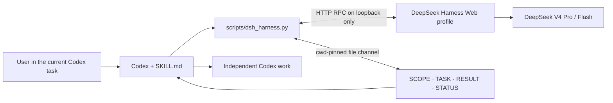

<div align="center">

# Delegate to DeepSeek Harness

**Asynchronous DeepSeek delegation for Codex — keep working while long-running Harness tasks run in parallel**

[](https://github.com/papperrollinggery/delegate-to-deepseek-harness/actions/workflows/ci.yml)
[](https://github.com/papperrollinggery/delegate-to-deepseek-harness/releases/latest)


[English](README.md) · [简体中文](README.zh-CN.md) · [Use cases](docs/use-cases.md) · [Security](SECURITY.md)

</div>

Delegate bounded work from the current Codex task to a locally running [DeepSeek Harness](https://github.com/deepseek-ai/deepseek-harness), then let Codex continue independent work immediately. This asynchronous DeepSeek–Codex collaboration Skill uses the Harness loopback Web API and a durable, working-directory-pinned file channel to submit tasks, monitor multi-hour runs without an arbitrary 900-second limit, collect a verified `turn/end`, and continue the same conversation.

It is designed for focused copywriting, research synthesis, video-preproduction text, coding, review, and second-opinion workflows inside larger projects. It does **not** spawn a Codex subagent, create another Codex task, render video, or publish anything.

> Community project. Not affiliated with or endorsed by OpenAI or DeepSeek. DeepSeek Harness is currently a developer preview and may introduce compatibility-breaking changes.

## At a glance

| Question | Answer |
| --- | --- |
| What is it? | A standalone Codex Skill plus a Python standard-library client for DeepSeek Harness. |
| Can Codex and DeepSeek work in parallel? | Yes. `delegate` returns after acceptance; Codex continues other work and later uses `collect`. |
| How long can a task run? | There is no default wall-clock wait limit. An optional client deadline never cancels the Harness task. |
| Where does it connect? | Only to literal loopback hosts: `127.0.0.1`, `localhost`, or `::1`. |
| Which Harness version is targeted? | `@deepseek-ai/dsh 0.1.0-rc.6` Web profile. |
| Which models are supported? | `deepseek-v4-pro` and `deepseek-v4-flash` through `deepseek-official`. |
| How are results exchanged? | `SCOPE.md`, `TASK.md`, `RESULT.md`, `OPINION.md`, `ASK.md`, and `STATUS.json`. |
| Does it require a Python package? | No. `scripts/dsh_harness.py` uses only the Python 3 standard library. |
| Is it an authentication boundary? | No. The Harness Web API has no authentication boundary; keep it on loopback only. |

## Why this Skill exists

Calling a second model is easy. Keeping that collaboration scoped, observable, and recoverable is the hard part.

- **Bounded delegation** — pin every new session to an explicit working directory and task scope.
- **Parallel execution** — return after Harness accepts the task so Codex can advance an independent workstream.
- **Long-running jobs** — monitor real session health and collect results without a fixed 900-second task limit.
- **Durable handoff** — preserve task, scope, result, opinion, question, and status files on disk.
- **Verified completion** — collect the matching `turn/end`; do not treat a queued prompt as finished work.
- **Update awareness** — check once per day for a published Skill version and ask before installing it.
- **Bidirectional work** — read results back, inspect live status, and continue the same Harness session.
- **Local control plane** — refuse non-loopback endpoints, redirects, credential-bearing URLs, and broad root directories.
- **Honest safety model** — treat `workspace-write` as a write boundary, not as read or network isolation.

## Common use cases

| Workstream inside a larger project | Recommended route | Typical output |
| --- | --- | --- |
| Campaign copy, product copy, VO, supers, or headline variants | `standard` · `deepseek-v4-pro` · `proposal-only` or dedicated `single-dir` | Copy alternatives in `RESULT.md` or files in a copy-only directory |
| Video treatment, story beats, shot-description review, subtitle cleanup, generation-prompt preflight | `standard` · `deepseek-v4-pro` · `proposal-only` | Text-based preproduction notes; no rendering or publishing |
| Fast rewrite, summarization, or low-risk iteration | `standard` · `deepseek-v4-flash` · narrow scope | Rapid draft or structured summary |
| Multi-file code implementation | `code` · `deepseek-v4-pro` · `cross-file` | Focused source edits plus verification notes |
| Independent review or second opinion | `standard` · `deepseek-v4-pro` · `proposal-only` | `RESULT.md` and optional `OPINION.md` without project-file edits |
| Harness composition development | `cordis` only when explicitly requested | Composition proposal or scoped implementation |

See the [copy-paste use-case cookbook](docs/use-cases.md) for detailed prompts, routing decisions, and video-workflow boundaries.

## How it works



The orchestration loop stays in the current Codex task. `delegate` writes the scope and task contract, creates a Harness session pinned to `--cwd`, records the accepted `sessionId` and `rpcId`, and returns. Codex can keep working, use `status` or a short `collect --timeout 1` check at natural checkpoints, and finally collect the corresponding completed turn. A client wait deadline never cancels the Harness work.

## Requirements

- Codex with [custom Skill support](https://developers.openai.com/codex/skills)
- Python 3.10 or newer
- Node.js supported by the current DeepSeek Harness release
- DeepSeek Harness Web profile; this repository currently targets `@deepseek-ai/dsh 0.1.0-rc.6`
- DeepSeek provider credentials configured directly in Harness, never in this repository or delegated task text

The client is tested locally on macOS and in Linux CI. Its Windows file-locking fallback is not yet covered by live end-to-end verification, and `start`/`stop` require POSIX process and signal support.

## Install

### 1. Install and start DeepSeek Harness

For the compatibility-tested version:

```sh
npm install --global @deepseek-ai/dsh@0.1.0-rc.6
dsh --version
dsh web
```

The Web UI is served at `http://127.0.0.1:3080` by default. Configure the provider in Harness itself. Do not put API keys in this repository, prompts, or collaboration files.

If you prefer not to install globally, run the service manually with:

```sh
npx @deepseek-ai/dsh@0.1.0-rc.6 web
```

The Skill's `start` command requires `dsh` to be installed on `PATH`.

Without `--dsh-home`, `start` uses a disposable Harness home under the OS temporary directory, so it does not reuse provider configuration or sessions from the normal Harness home. Pass a known Harness home explicitly when reuse is intended. On Windows or another non-POSIX platform, start Harness manually and use the RPC commands only.

### 2. Install the Codex Skill

Clone the repository and run the tested global installer. It copies only runtime artifacts into `${CODEX_HOME:-$HOME/.codex}/skills`:

```sh
git clone https://github.com/papperrollinggery/delegate-to-deepseek-harness.git
cd delegate-to-deepseek-harness
bash scripts/install-global.sh
```

Open a fresh Codex task after installation so Skill discovery is refreshed.

### 3. Update checks

When the Skill is used, `scripts/check-update.sh` reads GitHub's latest published release metadata at most once per day. It is silent when current or offline. When a newer release exists, Codex should ask before running:

```sh
bash scripts/update-global.sh
```

The updater downloads the matching GitHub release tag and reuses the global installer. It never runs without user approval. Set `DSH_DISABLE_UPDATE_CHECK=1` to disable automatic checks.

## Quick start

Ask Codex directly:

```text
Use $delegate-to-deepseek-harness to give DeepSeek the copywriting workstream in
/absolute/project/workstreams/copy. Ask for three concise campaign directions,
proposal only, and read the result and status back into this task.
```

For a video-preproduction stage:

```text
Use $delegate-to-deepseek-harness to review the story beats, VO, supers, and
shot descriptions in /absolute/project/video-treatment. This is text-only
preproduction: do not render, edit, upload, or publish media. Return a proposal
and flag unsupported claims.
```

Codex should probe the service, choose the narrowest scope, submit the task, continue independent work, collect the result, inspect `STATUS.json`, and report the session ID, preset, working directory, completion reason, and remaining uncertainty.

## Parallel and long-running workflow

`delegate` is asynchronous by default. It returns once Harness accepts the prompt, so a task that takes several hours does not hold Codex at the command line:

```sh
python3 scripts/dsh_harness.py delegate \
  --cwd /absolute/project/path \
  --scope proposal-only \
  --text-file /absolute/project/deepseek-task.txt

# Codex does other independent work here.
python3 scripts/dsh_harness.py status --cwd /absolute/project/path
python3 scripts/dsh_harness.py collect --cwd /absolute/project/path --timeout 1

# When the result becomes a hard dependency, collect without a deadline.
python3 scripts/dsh_harness.py collect --cwd /absolute/project/path
python3 scripts/dsh_harness.py read-back --cwd /absolute/project/path
```

`--timeout` is an optional client-side wait deadline, not a DeepSeek execution limit. Reaching it returns `pending`/`running`, preserves the same `sessionId` and `rpcId`, and never cancels the Harness turn. With no deadline, the client keeps waiting while the session is active and reports `stalled` only when Harness has stopped reporting it as running for a grace period without a matching `turn/end`. Use `delegate --wait` only when no independent Codex work can proceed.

## Choose the right route

### Preset

| Preset | Use it for | Rule |
| --- | --- | --- |
| `standard` | Writing, synthesis, analysis, video-preproduction text, and opinions | Default |
| `code` | Explicit coding, repository implementation, or source-focused review | Use only for coding work |
| `cordis` | Harness composition development | Use only when explicitly requested |
| `minimal` | Nothing | Deliberately rejected because RC.6 does not provide the expected file-write sandbox |

### Scope

| Scope | Expected write scope | Best fit |
| --- | --- | --- |
| `proposal-only` | Collaboration control files only | Review, opinion, first-pass copy, treatment feedback |
| `single-dir` | One dedicated directory | Copy deck, transcript, storyboard text, self-contained asset notes |
| `cross-file` | Multiple files under one project root | Implementation or coordinated multi-file work |
| `auto` | Heuristic selection | Use only when the task language and directory layout are unambiguous |

### Model

- Use `deepseek-v4-pro` by default for nuanced writing, multi-file reasoning, and higher-cost mistakes.
- Use `deepseek-v4-flash` for fast, low-risk iteration when the deployment-wide default-model mutation is acceptable.
- Every `create`, `run`, or `delegate` call selects the session model and also persists it as the Harness deployment default in RC.6. Use an existing session with `send`, or stop and ask, when that shared setting must not change.

## CLI reference

Run the client directly from this repository or the installed Skill directory:

```sh
python3 scripts/dsh_harness.py --help
```

| Command | Purpose |
| --- | --- |
| `probe` | Check Web and RPC readiness |
| `list` | List concise session summaries |
| `delegate` | Submit a scoped file-channel task and return after acceptance |
| `collect` | Check or wait for the recorded turn and finalize `RESULT.md` / `STATUS.json` |
| `read-back` | Read `RESULT.md`, `OPINION.md`, and `ASK.md` |
| `status` | Combine durable status with live session state |
| `send` | Continue an existing Harness session |
| `wait` | Wait for one previously accepted prompt by RPC ID |
| `result` | Read the last completed turn |
| `create` / `run` | Use lower-level session and prompt flows |
| `cancel` | Cancel an active turn only when requested or necessary |
| `start` / `stop` | Start a loopback service; stop only a service owned by this client and refuse while sessions are running |
| `open-ui` | Open the already-running local Web UI |

For long or shell-sensitive instructions, use `--text-file` rather than a large inline `--text` value.

The low-level `wait --baseline-seq N --baseline-fallback` recovery mode is only safe for a fresh session where no earlier turn can finish after baseline `N` (for example, `run --no-wait`). Never enable it for a prompt queued behind an existing running turn. Normal `delegate`/`collect` handles this automatically.

## File channel contract

| File | Role |
| --- | --- |
| `SCOPE.md` | Declares read/write patterns, forbidden paths, task type, and enforcement limits |
| `TASK.md` | Contains the bounded task and output protocol |
| `RESULT.md` | Primary result; a model-written file is preserved |
| `OPINION.md` | Optional review comments or suggestions |
| `ASK.md` | Scope-expansion request or blocking question; never auto-approved |
| `STATUS.json` | Durable session ID, RPC ID, pre-prompt baseline sequence, model, preset, scope, status, reason, and update time |

The `delegate`, `run`, and `send` prompting paths share a per-directory process lock outside the workspace. Before `delegate` reuses a working directory, it also refuses to proceed while any Harness session for that `cwd` is still running, then moves the previous run's control files into `.dsh-delegation-history/<run-id>/`. This preserves the earlier files and prevents already-existing stale `RESULT.md`, `OPINION.md`, or `ASK.md` content from being read as the current result. Treat the history directory as sensitive task data and keep it out of version control.

`REPLY.md` is reserved for a possible future append-only response channel and is not implemented.

## Security model

This client provides guardrails, not a security sandbox.

- Accept only `http://127.0.0.1`, `http://localhost`, or `http://[::1]` endpoints.
- Disable proxy use and refuse redirects, URL credentials, non-loopback resolution, broad filesystem roots, and the `minimal` preset.
- Reject obvious secret patterns in delegated task text and symlinked collaboration files.
- Serialize this client's `delegate`, `run`, and `send` prompting paths per working directory; reject unsafe overlap with other running same-directory sessions.
- Never expose the Harness Web API on a LAN or public interface; it has no authentication boundary.
- Assume `workspace-write` restricts writes only. It does not restrict same-user reads or outbound network access.
- Never delegate credentials, private keys, payment actions, publishing, deployment, or destructive changes without explicit authorization.
- Never auto-answer a Harness approval or scope question.
- The daily update check makes one short read-only request to this repository's public latest-release metadata, sends no task content, and can be disabled with `DSH_DISABLE_UPDATE_CHECK=1`. Installation still requires user approval.

Read the full [security policy and disclosure guidance](SECURITY.md).

## FAQ

### Is this an official OpenAI or DeepSeek project?

No. It is a community Codex Skill that integrates with the official DeepSeek Harness developer preview. The project names and trademarks belong to their respective owners.

### Does it create another Codex task or subagent?

No. The control loop remains in the current Codex task. DeepSeek work runs in a separate local Harness session, not as a Codex subagent.

### Can Codex keep working while DeepSeek runs for hours?

Yes. `delegate` returns after prompt acceptance. Codex should continue any independent work, use `status` or short `collect --timeout 1` checks at natural checkpoints, and call `collect` without a deadline only when the result becomes a hard dependency. There is no default 900-second task limit.

### Does the Skill update itself silently?

No. It checks GitHub's latest published release metadata at most once per day and stays silent when current or offline. If a newer release exists, it asks the user before `update-global.sh` downloads and installs that release.

### Can it generate or edit a video?

Not by itself. It can delegate text-based video stages such as treatments, story beats, scripts, VO, supers, shot descriptions, subtitle cleanup, continuity review, and generation-prompt preflight. Rendering, timeline editing, media export, upload, and publication require separate tools and authorization.

### Is `proposal-only` fully read-isolated?

No. It is an instructional guardrail that declares collaboration control files as the expected write targets; the actual Harness session write boundary remains the selected `cwd`. It does not prevent other writes, same-user file reads, or network access. Select a safe working directory and do not expose secrets.

### Why is `minimal` rejected?

The RC.6 composition does not provide the file-write sandbox this workflow expects. The client fails closed instead of presenting it as a safe preset.

### Why can model selection affect other sessions?

In the targeted RC.6 behavior, `session.selectModel` also persists the deployment-wide default. The client reports this side effect and does not describe model selection as session-only.

## Development

The runtime surface intentionally stays small:

```text
VERSION                   Installed and published Skill version
SKILL.md                  Skill trigger and operating contract
agents/openai.yaml        Codex-facing display metadata
scripts/dsh_harness.py    Loopback-only standard-library RPC client
scripts/check-update.sh   Quiet daily release check
scripts/install-global.sh Global Codex Skill installer
scripts/update-global.sh  Approval-gated release updater
```

The maintained installer keeps repository documentation, tests, CI, and community files out of the installed runtime Skill.

Run the local release gates:

```sh
python3 -c 'source=open("scripts/dsh_harness.py", encoding="utf-8").read(); compile(source, "scripts/dsh_harness.py", "exec"); print("syntax-ok")'
python3 -m unittest discover -s tests -v
python3 scripts/dsh_harness.py --help
python3 scripts/dsh_harness.py --base-url http://192.0.2.10:3080 probe
```

The final command must exit non-zero. Live `probe`, `list`, and delegate tests require a locally running Harness and must not mutate pre-existing sessions.

## Contributing and support

- Read [CONTRIBUTING.md](CONTRIBUTING.md) before opening a pull request.
- Use GitHub Issues for reproducible bugs and focused feature requests.
- Use the private vulnerability-reporting path described in [SECURITY.md](SECURITY.md) for security issues.
- DeepSeek Harness product issues belong in the [official DeepSeek Harness repository](https://github.com/deepseek-ai/deepseek-harness).

## License

This project is licensed under the [MIT License](LICENSE).
