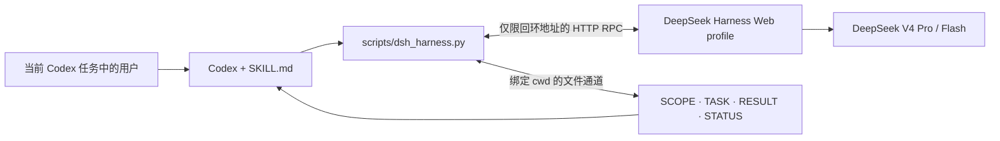

<div align="center">

# Delegate to DeepSeek Harness

**一个让 Codex 与 DeepSeek Harness 在本机双向协作、按范围委派的 Skill**

[](https://github.com/papperrollinggery/delegate-to-deepseek-harness/actions/workflows/ci.yml)


[English](README.md) · [简体中文](README.zh-CN.md) · [使用场景](docs/use-cases.zh-CN.md) · [安全说明](SECURITY.md)

</div>

把当前 Codex 任务里一块边界清楚的工作，委派给本机运行的 [DeepSeek Harness](https://github.com/deepseek-ai/deepseek-harness)。这个 Skill 通过 Harness 的回环 Web API 和绑定工作目录的持久文件通道下发任务、等待真实的回合结束、读回结果，并在同一个 Codex 任务里继续协作。

它适合在复杂项目中单独处理文案、资料归纳、视频前期文字、代码实现、审查和第二意见。它**不会**创建新的 Codex 任务或 Codex subagent，也不会自行生成视频、上传或发布内容。

> 社区项目，与 OpenAI、DeepSeek 无隶属或官方背书关系。DeepSeek Harness 当前仍是 developer preview，后续可能出现破坏性兼容变化。

## 一眼看懂

| 问题 | 答案 |
| --- | --- |
| 它是什么？ | 一个独立 Codex Skill，加上一支只使用 Python 标准库的 DeepSeek Harness 客户端。 |
| 连接到哪里？ | 只接受 `127.0.0.1`、`localhost` 或 `::1` 这三类字面回环地址。 |
| 当前针对哪个 Harness 版本？ | `@deepseek-ai/dsh 0.1.0-rc.6` 的 Web profile。 |
| 支持哪些模型？ | `deepseek-official` 下的 `deepseek-v4-pro` 与 `deepseek-v4-flash`。 |
| 如何交换结果？ | 通过 `SCOPE.md`、`TASK.md`、`RESULT.md`、`OPINION.md`、`ASK.md`、`STATUS.json`。 |
| 需要安装 Python 依赖吗？ | 不需要；`scripts/dsh_harness.py` 只用 Python 3 标准库。 |
| 它是不是认证边界？ | 不是；Harness Web API 没有认证边界，必须只监听回环地址。 |

## 为什么需要这个 Skill

调用第二个模型不难；真正困难的是让协作有边界、可观察、可恢复。

- **按范围委派**：每个新会话都绑定明确工作目录和任务范围。
- **持久交接**：任务、范围、结果、意见、反问和状态全部写入可回读文件。
- **核验完成**：等待对应的 `turn/end`，不会把“提示已入队”说成“工作已完成”。
- **双向协作**：读回结果、检查实时状态，并可继续同一个 Harness 会话。
- **本机控制面**：拒绝非回环端点、跳转、带凭据 URL 和过宽的根目录。
- **诚实安全模型**：`workspace-write` 只视作写入边界，不冒充读取或网络隔离。

## 常见使用场景

| 复杂项目中的独立环节 | 推荐路由 | 典型产物 |
| --- | --- | --- |
| Campaign 文案、产品文案、VO、SUPER、标题方案 | `standard` · `deepseek-v4-pro` · `proposal-only` 或专用 `single-dir` | `RESULT.md` 里的文案候选，或文案专用目录中的文件 |
| 视频 treatment、故事节拍、镜头文字复核、字幕整理、生成提示词预检 | `standard` · `deepseek-v4-pro` · `proposal-only` | 文字型前期建议；不包含渲染或发布 |
| 快速改写、摘要、低风险迭代 | `standard` · `deepseek-v4-flash` · 最小范围 | 快速草稿或结构化摘要 |
| 跨文件代码实现 | `code` · `deepseek-v4-pro` · `cross-file` | 聚焦的源码修改和验证说明 |
| 独立审查或第二意见 | `standard` · `deepseek-v4-pro` · `proposal-only` | 不改项目文件的 `RESULT.md` 与可选 `OPINION.md` |
| Harness composition 开发 | 仅在明确要求时使用 `cordis` | composition 方案或受限实现 |

更多可直接复制的指令、路由判断和视频环节边界见[中文使用场景手册](docs/use-cases.zh-CN.md)。

## 工作原理



整个总控循环留在当前 Codex 任务中。`delegate` 会写入范围与任务契约，创建绑定 `--cwd` 的 Harness 会话，等待对应回合完成，保留模型亲自写入的 `RESULT.md`，并记录持久状态。

## 环境要求

- 支持[自定义 Skill](https://developers.openai.com/codex/skills) 的 Codex
- Python 3.10 或更高版本
- 当前 DeepSeek Harness 版本所支持的 Node.js
- DeepSeek Harness Web profile；本仓库当前针对 `@deepseek-ai/dsh 0.1.0-rc.6`
- 在 Harness 内部直接配置 DeepSeek provider 凭据；绝不把凭据放入本仓库或委派任务文字

客户端已在 macOS 本机与 Linux CI 配置中测试；Windows 文件锁 fallback 尚未经过真实端到端验证。

## 安装

### 1. 安装并启动 DeepSeek Harness

安装当前兼容性目标版本：

```sh
npm install --global @deepseek-ai/dsh@0.1.0-rc.6
dsh --version
dsh web
```

Web UI 默认位于 `http://127.0.0.1:3080`。请只在 Harness 自身界面中配置 provider，不要把 API key 写进本仓库、提示词或协作文件。

如不希望全局安装，可手动运行：

```sh
npx @deepseek-ai/dsh@0.1.0-rc.6 web
```

Skill 的 `start` 命令需要 `dsh` 已安装并存在于 `PATH`。

### 2. 安装 Codex Skill

克隆仓库，只复制运行所需文件：

```sh
git clone https://github.com/papperrollinggery/delegate-to-deepseek-harness.git
cd delegate-to-deepseek-harness

install_dir="${CODEX_HOME:-$HOME/.codex}/skills/delegate-to-deepseek-harness"
mkdir -p "$install_dir/agents" "$install_dir/scripts"
rsync -a SKILL.md "$install_dir/SKILL.md"
rsync -a agents/openai.yaml "$install_dir/agents/openai.yaml"
rsync -a scripts/dsh_harness.py "$install_dir/scripts/dsh_harness.py"
```

安装后新建一个 Codex 任务，让 Skill discovery 重新加载。

## 快速开始

直接在 Codex 中说：

```text
使用 $delegate-to-deepseek-harness，把
/absolute/project/workstreams/copy 里的文案环节交给 DeepSeek。
请给出三个简洁的 campaign 方向，只出方案，不修改项目文件；
完成后把结果和状态读回当前任务。
```

处理视频前期环节时可以说：

```text
使用 $delegate-to-deepseek-harness，复核
/absolute/project/video-treatment 中的故事节拍、VO、SUPER 和镜头文字。
这是纯文字前期工作：不要渲染、剪辑、上传或发布媒体。
只返回方案，并标记没有来源支撑的宣传口径。
```

Codex 应先探测服务，选择最小范围，执行委派，读取 `RESULT.md`，核对 `STATUS.json`，并报告 session ID、preset、工作目录、完成原因与剩余不确定性。

## 如何选择路由

### Preset

| Preset | 适用任务 | 规则 |
| --- | --- | --- |
| `standard` | 文案、归纳、分析、视频前期文字和意见 | 默认选择 |
| `code` | 明确的编码、仓库实现或源码审查 | 仅编码任务使用 |
| `cordis` | Harness composition 开发 | 仅用户明确要求时使用 |
| `minimal` | 不使用 | RC.6 没有提供此工作流预期的文件写入 sandbox，因此客户端主动拒绝 |

### Scope

| Scope | 预期写入范围 | 最适合 |
| --- | --- | --- |
| `proposal-only` | 只写协作控制文件 | 审查、意见、首轮文案、treatment 反馈 |
| `single-dir` | 一个专用目录 | 文案包、转录稿、分镜文字、独立素材说明 |
| `cross-file` | 一个项目根目录下的多个文件 | 实现或跨文件协同工作 |
| `auto` | 由启发式判断 | 只有任务语言和目录结构都无歧义时使用 |

### Model

- 对细腻文案、跨文件推理和错误成本较高的任务，默认使用 `deepseek-v4-pro`。
- 只有在能够接受 deployment-wide 默认模型被改动时，才用 `deepseek-v4-flash` 做快速低风险迭代。
- RC.6 中，每次 `create`、`run` 或 `delegate` 不只选择当前会话模型，也会持久化 Harness 的部署级默认模型。如该共享设置不能变化，应使用已有会话配合 `send`，或暂停确认。

## CLI 命令

可以从本仓库或已安装的 Skill 目录直接运行：

```sh
python3 scripts/dsh_harness.py --help
```

| 命令 | 用途 |
| --- | --- |
| `probe` | 检查 Web 与 RPC 是否就绪 |
| `list` | 输出精简会话清单 |
| `delegate` | 创建带范围文件通道的任务并等待 |
| `read-back` | 读取 `RESULT.md`、`OPINION.md`、`ASK.md` |
| `status` | 合并持久状态与实时会话状态 |
| `send` | 继续已有 Harness 会话 |
| `wait` | 根据 RPC ID 等待先前已接受的提示 |
| `result` | 读取最后一个已完成回合 |
| `create` / `run` | 更底层的会话与提示流程 |
| `cancel` | 仅在用户要求或确需停止时取消活跃回合 |
| `start` / `stop` | 启动回环服务，或只停止由本客户端启动的服务 |
| `open-ui` | 打开已经运行的本机 Web UI |

对于较长或涉及 shell 特殊字符的任务，优先使用 `--text-file`，不要塞进很长的 `--text`。

## 文件通道契约

| 文件 | 作用 |
| --- | --- |
| `SCOPE.md` | 声明读写模式、禁止路径、任务类型和实际限制说明 |
| `TASK.md` | 保存有边界的任务和输出协议 |
| `RESULT.md` | 主结果；如果模型亲自写入则原样保留 |
| `OPINION.md` | 可选的复核意见或建议 |
| `ASK.md` | 扩权请求或阻塞问题；绝不自动批准 |
| `STATUS.json` | 持久记录会话 ID、模型、preset、scope、RPC ID、状态、原因与更新时间 |

`delegate`、`run` 与 `send` 三条提示路径共用工作区外的目录专属进程锁。当 `delegate` 再次使用同一工作目录时，只要 Harness 中仍有使用同一 `cwd` 的运行中会话，就拒绝继续；随后才把上一轮控制文件移入 `.dsh-delegation-history/<run-id>/`。这样既保留旧文件，也不会把已经存在的旧 `RESULT.md`、`OPINION.md` 或 `ASK.md` 误读为本轮结果。历史目录仍属于敏感任务资料，应排除在版本控制之外。

`REPLY.md` 仅为未来可能的 append-only 回复通道预留，目前尚未实现。

## 安全模型

这个客户端提供 guardrails，但不是完整安全 sandbox。

- 只接受 `http://127.0.0.1`、`http://localhost` 或 `http://[::1]`。
- 禁用代理并拒绝跳转、URL 凭据、非回环解析、过宽文件系统根目录和 `minimal` preset。
- 拒绝任务文字中的明显 secret 模式和以符号链接伪装的协作文件。
- 同一工作目录内，本客户端的 `delegate`、`run` 与 `send` 提示路径必须串行，并拒绝与其它同目录运行中会话发生不安全重叠。
- 不要把 Harness Web API 暴露到局域网或公网；它没有认证边界。
- 假定 `workspace-write` 只限制写入，不限制同用户读取或出站网络。
- 未经明确授权，不委派凭据、私钥、支付、发布、部署或破坏性修改。
- 不自动回答 Harness 的审批或范围问题。

完整规则和漏洞报告方式见[安全政策](SECURITY.md)。

## 常见问题

### 这是 OpenAI 或 DeepSeek 官方项目吗？

不是。这是一个对接 DeepSeek 官方 Harness developer preview 的社区 Codex Skill。相关项目名称和商标归各自所有者。

### 它会创建新的 Codex 任务或 subagent 吗？

不会。总控循环始终留在当前 Codex 任务中。DeepSeek 工作运行在独立的本机 Harness 会话，而不是 Codex subagent。

### 它能生成或剪辑视频吗？

不能单独完成这些动作。它适合委派 treatment、故事节拍、脚本、VO、SUPER、镜头文字、字幕整理、连贯性复核和生成提示词预检等文字环节。渲染、时间线剪辑、媒体导出、上传和发布需要其它工具与授权。

### `proposal-only` 是否实现了读取隔离？

没有。它只是把协作控制文件声明为预期写入目标的指令性 guardrail；Harness 会话的实际写入边界仍是选中的 `cwd`。它不会阻止其它写入、同用户文件读取或网络访问。必须选择安全工作目录，并确保其中没有 secret。

### 为什么拒绝 `minimal`？

RC.6 的该 composition 没有提供本工作流预期的文件写入 sandbox。客户端选择 fail closed，而不是把它包装成安全 preset。

### 为什么选择模型会影响其它会话？

在当前针对的 RC.6 行为中，`session.selectModel` 还会持久化 deployment-wide 默认值。本客户端会明确报告这项副作用，不把它描述成纯会话级设置。

## 开发与验证

运行时表面刻意保持精简：

```text
SKILL.md                 Skill 触发与运行契约
agents/openai.yaml       Codex 展示元数据
scripts/dsh_harness.py   仅限回环、只用标准库的 RPC 客户端
```

按照上面的推荐同步方式安装时，仓库层的文档、测试、CI 与社区文件不会复制进 Skill 运行副本。

执行本地发布门禁：

```sh
python3 -c 'source=open("scripts/dsh_harness.py", encoding="utf-8").read(); compile(source, "scripts/dsh_harness.py", "exec"); print("syntax-ok")'
python3 -m unittest discover -s tests -v
python3 scripts/dsh_harness.py --help
python3 scripts/dsh_harness.py --base-url http://192.0.2.10:3080 probe
```

最后一条命令必须以非零状态退出。实时 `probe`、`list` 和 delegate 测试需要本机 Harness 已运行，而且不得修改任何预先存在的会话。

## 贡献与支持

- 提交 Pull Request 前先读 [CONTRIBUTING.md](CONTRIBUTING.md)。
- 可复现 bug 和聚焦的功能请求请使用 GitHub Issues。
- 安全问题请使用 [SECURITY.md](SECURITY.md) 中的私密漏洞报告路径。
- DeepSeek Harness 产品本身的问题应提交到 [DeepSeek Harness 官方仓库](https://github.com/deepseek-ai/deepseek-harness)。

## 许可证

本仓库目前没有 `LICENSE`。在维护者明确选择许可证前，公开可见不等于授予复制、修改或再分发许可。DeepSeek Harness 官方仓库的 MIT 许可证不会自动覆盖本仓库。
